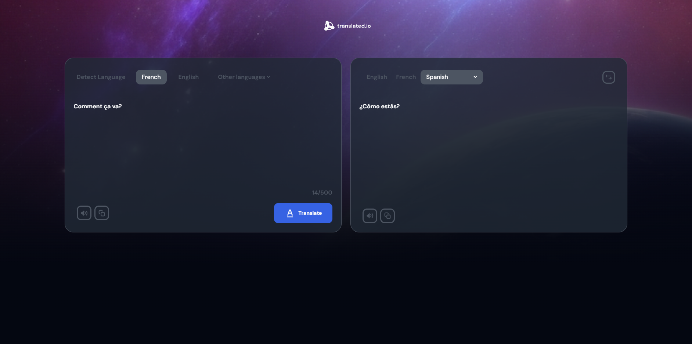

Il s'agit d'une solution pour le défi [Dev Challenges](https://devchallenges.io/challenge/47) sur Dev Challenges.

## Table des matières

- [Aperçu](#aperçu)
  - [Le défi](#le-défi)
  - [Capture d'écran](#capture-décran)
  - [Liens](#liens)
  - [Construit avec](#construit-avec)
- [Auteur](#auteur)

## Aperçu

### Le défi

- Les utilisateurs doivent pouvoir : 

    - Modifier le texte à traduire avec un maximum de 500 caractères.

    - Voir le texte traduit après avoir sélectionné le bouton Traduire.

    - Choisir différentes langues pour la traduction. Ils devraient voir au moins 3 options : Détecter la langue, Anglais et Français.

    - Ecouter les textes traduits et les textes traduits.

    - Copier les textes traduits et traduits.

### Capture d'écran

### Liens

- [URL du site en direct](https://translate-b-alexandre.netlify.app)

### Construit avec

- Vite (Framework React)
- TailwindCSS
- API fetch
- [ResponsiveVoice] (https://responsivevoice.org)
- [Mymemory] (https://mymemory.translated.net)

## Auteur

- Dev Challenge - [@CallMeAl3x](https://devchallenges.io/profile/4b9e326e-7fac-4811-b859-ca80373be3dd)